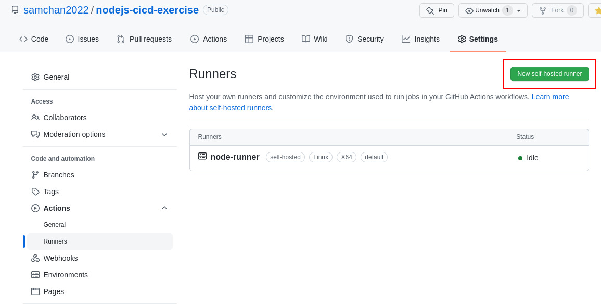
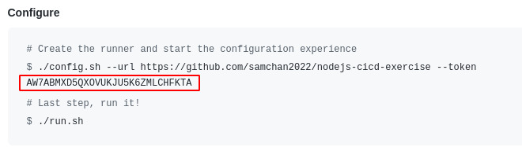

Steps
---------------------------------------------------
1. create a simple node project
2. Push the project to git
3. Set up workflow in github

Obtain a token for self host runner from github
---------------------------------------------------
- Click New self host runner

- Copy the token

Set up github self host runner docker in server
---------------------------------------------------
**Running github runner in Docker is more secure than running in server directly**

https://github.com/samchan2022/gh-self-host-runner

